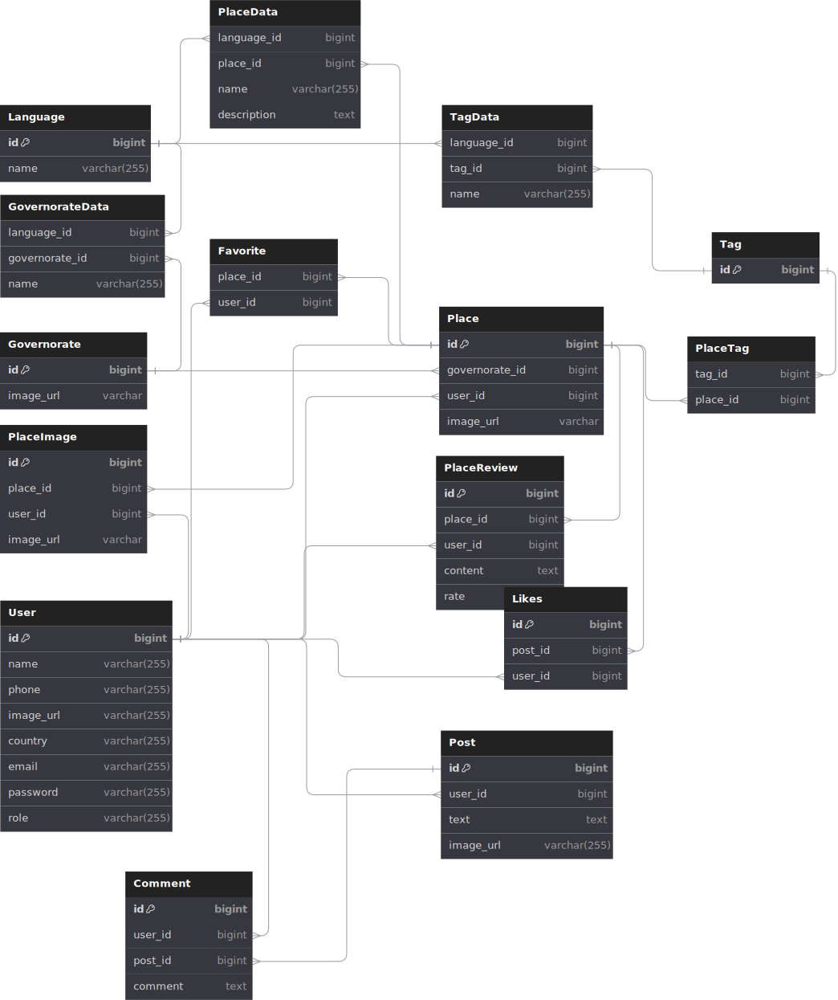

# AroundEgyptAPI

## Description

AronudEgyptAPI is a RESTful API that provides information about the most famous places in Egypt. It provides information about the place, its location, also upload images for the place and reviews for the place, booking tickets and more.

## Technologies

- Node.js
- Express.js
- Vitest
- ORM Prisma using Postgres

## Database design

#### link to the database design [here](https://dbdiagram.io/d/Around-Egypt-65a29631ac844320aed806d6)

